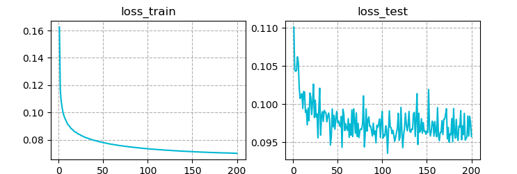

# 3d_pose_baseline_pytorch

A PyTorch implementation of a simple baseline for 3d human pose estimation.
You can check the origin Tensorflow implementation written by [Julieta Martinez et al.](https://github.com/una-dinosauria/3d-pose-baseline).
Some codes for data processing are brought from the origin version, thanks to the authors.

This is the code for the paper

```
@inproceedings{martinez_2017_3dbaseline,
  title={A simple yet effective baseline for 3d human pose estimation},
  author={Martinez, Julieta and Hossain, Rayat and Romero, Javier and Little, James J.},
  booktitle={ICCV},
  year={2017}
}
```

## WIP


 - [ ] Training code
 - [x] Testing code

### Datasets

 - [x] Human3.6M
 - [ ] HumanEva


## Dependencies

* [h5py](http://www.h5py.org/)
* [PyTorch](http://pytorch.org/) >= 3.0.0

## Installation

1. First, clone this repository:
    ```
    git clone --recursive https://github.com/weigq/3d_pose_baseline_pytorch.git
    ```
2. Download the [Human3.6M](http://vision.imar.ro/human3.6m/description.php) dataset in 3d joints provided by the origin authors:
    ```
    wget https://www.dropbox.com/s/e35qv3n6zlkouki/h36m.zip
    unzip h36m.zip
    rm h36m.zip
    ```
3. (Optional) Download the fine-tuned stack hourglass 2d detections provided by the origin authors from [google drive](https://drive.google.com/open?id=0BxWzojlLp259S2FuUXJ6aUNxZkE).
    ```
    mkdir h36m_ft/
    tar -xzf stacked_hourglass_fined_tuned_240.tar.gz -C h36m_ft/
    rm stacked_hourglass_fined_tuned_240.tar.gz
    ```

## Usage

### Data preprocess

### Train

1. Train on Human3.6M groundtruth 2d joints:

2. Train on Human3.6M 2d joints detected by stacked hourglass:
```

```

You will get the training and testing loss curves like:



### Test

## License
MIT
